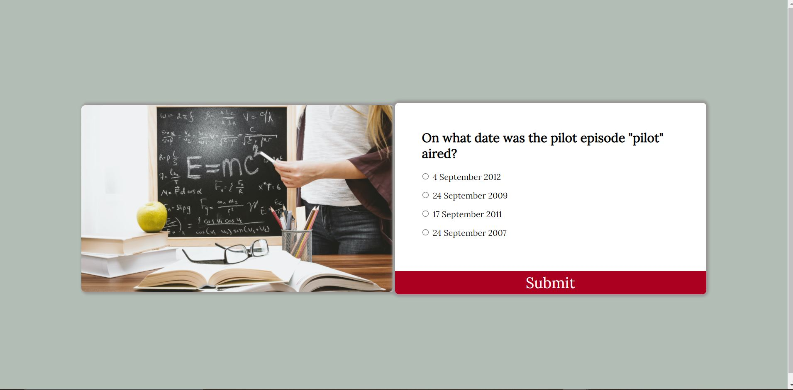
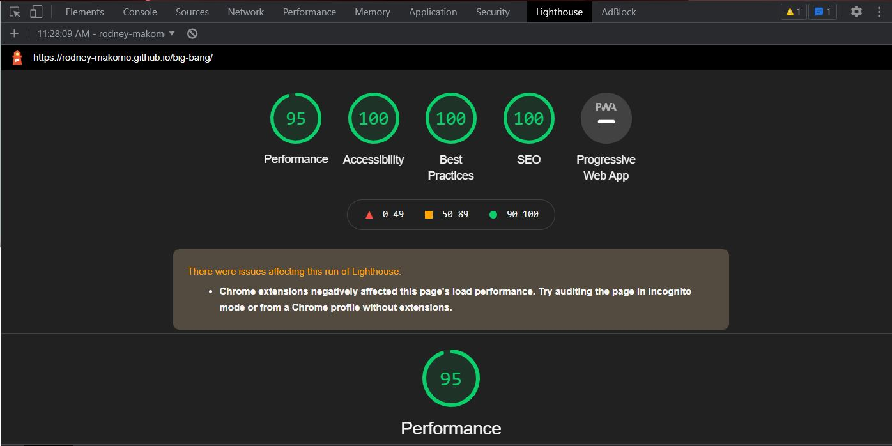

# Big Bang Quiz
https://rodney-makomo.github.io/big-bang/

By Rodney Makomo, 2021
**Version 1.0.0**

# What is this project? 
Big Bang is a project targeted towards fans of the TV show 'Big Bang Theory'. It's purpose is to test their knowledge of the show and their memory. This is what makes it fun to engage with and helps fans relive some of the best moments of the show. 

The quiz features questions relating to scenes and moments from all 12 seasons. All facts and answers were found on bigbangtheoryfandom.com and all answers can be checked if they're correct or not on there. I designed this quiz with the goal of alleviating people's boredom, whether that be at home or at the office; this quiz can provide you with a good dose of dopamine and also offer a challenge of the memory as some of the questions can be quite tricky to pinpoint. 

This project came to life because as a long time fan of The TV show 'The Big Bang Theory' I was missing it and missing some of the wonderful characters that were presented to us when the show was airing. From main characters like Sheldon to side characters like Howard, all their personalities were unique to say the least and they definitely left a lasting impression on me and I know that I won't have been the only one.

## Features
This project utilizes for loops and if statements to build and progress the quiz. The structure of the quiz is set out in a div in HTML and then javascript is used to loop an array that contains the questions and answers. At the end of the quiz your score is calculated and presented to the end user. Alongside the quiz, an image accompanies the div container. This was done to add a bit more life to the site as it was a bit lifeless just being the quiz container.

## Areas for improvement
What this project isn't good at and could improve on is the longevity of it as currently, it only contains a set number of questions and once completed you'll be able guess the ones you got wrong. I challenege someone out there to try and get 100% on this project. I could improve this project by adding more questions or adding another aray of question then using a function to randomly choose a set number of questions. This would decrease the predictability of this quiz.

## Languages and technologies used
 - Javascript
 - HTML
 - CSS
 - Github
 - Gitpod

 ## Validator Testing
 This was the result of my HTML test on the W3C validator. As you can see my HTML code passed with flying colours.

I tested out the responsiveness of my site on ami.responsivedesign.is/ and initially everything works as expected.

I checked my javascript code on jshint.com and confirmed that there were no significant issues.

I confirmed that this projects is responsive looks good on on various screensizes. I did this by using the devtools device toolbar and also used my own personal iPad and iPhone X to confirm this.

No errors were found when passing the officiaal Jigsaw validator.

    

## Deployment
I tested my site on Opera, MS Edge and Google chrome to confirm that my site works.

To deploy the site, I used the github pages tab on Github and built it from the main branch. After approximately 20 minutes my site was up and running.

I ran into an issue when deploying my site as I was getting an error 404. The site was unreachable and I had to troubleshoot this problem. I solved this when I figured out it was becuase my website had not been finished being built.
 

## Media
The images for this project were taken from pexels.com

## Credits
W3schools - Syntax purposes
Slack - to generate ideas of what to build.
bigbangtheoryfandom.com - answers

## Contributors
Rodney Makomo - rodneymakomo@gmail.com